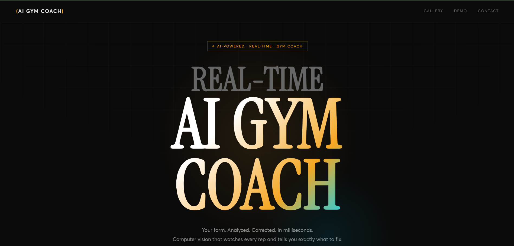
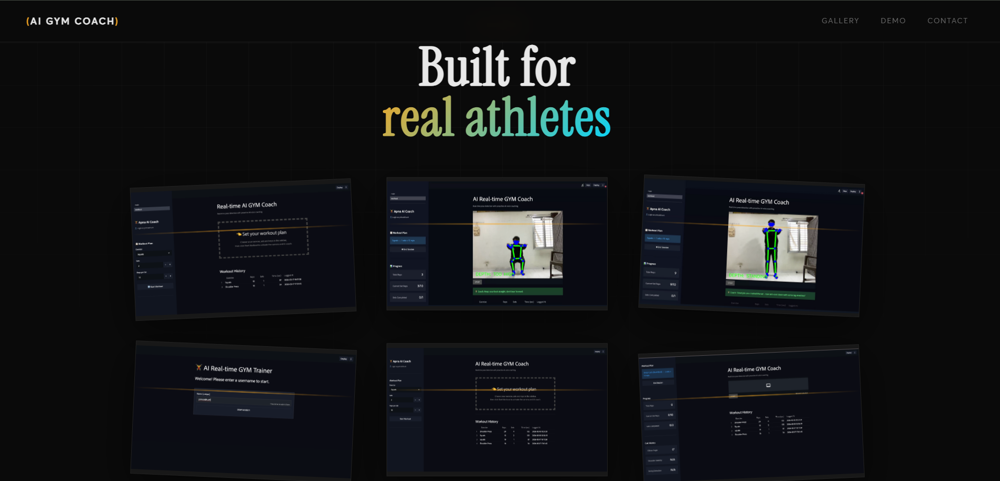
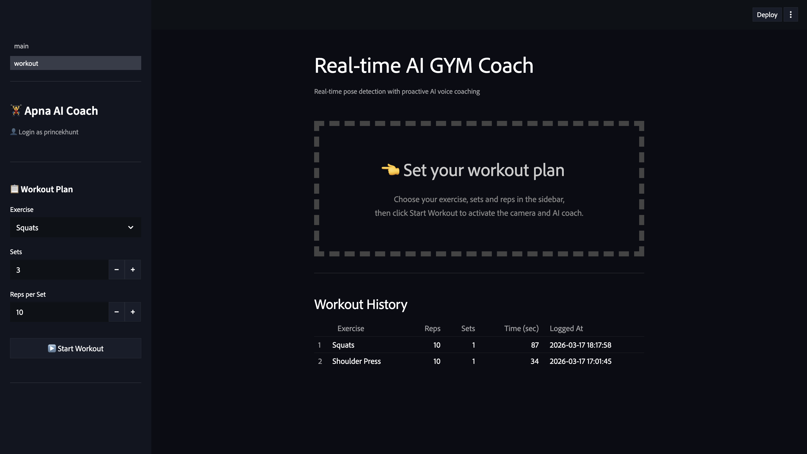
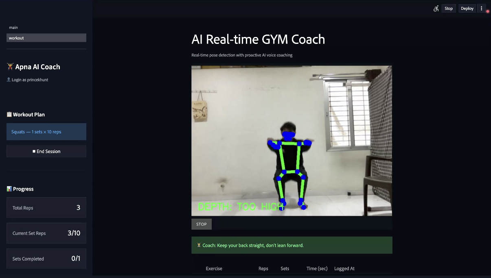

# 🏋️ AI Gym Coach – Full Project

This repository contains both the **Frontend (Landing Page/UI)** and **Backend (App)** of my AI-powered Real-time Gym Coach project.  

It demonstrates modern web design, computer vision, and AI coaching integrated into one seamless system.

---

## 📂 Project Structure
```
AI-Gym-Coach/
├── Landingpage/          # Frontend - Modern UI
├── App/                  # Backend - Flask/Streamlit + ML Models
└── README.md

```

## ✨ Frontend (Landing Page/UI)

Modern and clean interface for the AI Gym Coach.

### Features
- Responsive landing page with smooth animations  
- Interactive workout dashboard  
- Exercise library with demo videos  
- Clean, modern, and fully mobile-friendly design  
- Built with HTML, CSS, and Vanilla JavaScript  

### Screenshots




 

### Live Demo
👉 [Frontend Live Demo](https://sam-gym-coach.netlify.app)

---

## 🧠 Backend (App)

The core engine powering the **Real-time AI Gym Coach**.

### Features
- Real-time exercise detection using ML models  
- RESTful API endpoints for frontend integration  
- User progress and workout history management  
- Lightweight Flask/Streamlit server  
- Modular and scalable structure  

### Backend Structure
```
App/
├── core/
├── detectors/
├── ml_models/
├── pages/
├── services/
├── static/
├── videos/
├── screenshots/
├── main.py
├── requirements.txt
└── .env                  # Environment variables (ignored in Git)
```

### Screenshots


  

### Live Demo
👉 [Backend Live Demo](https://sam-ai-gym-coach.streamlit.app)

---


🧩 Tech Stack

Frontend: HTML, CSS, JavaScript
Backend: Python, Flask, Streamlit
Computer Vision: OpenCV, MediaPipe
AI Coaching: Groq API, gTTS
Database: SQLite
Deployment: Netlify (Frontend), Streamlit Cloud / Render (Backend)